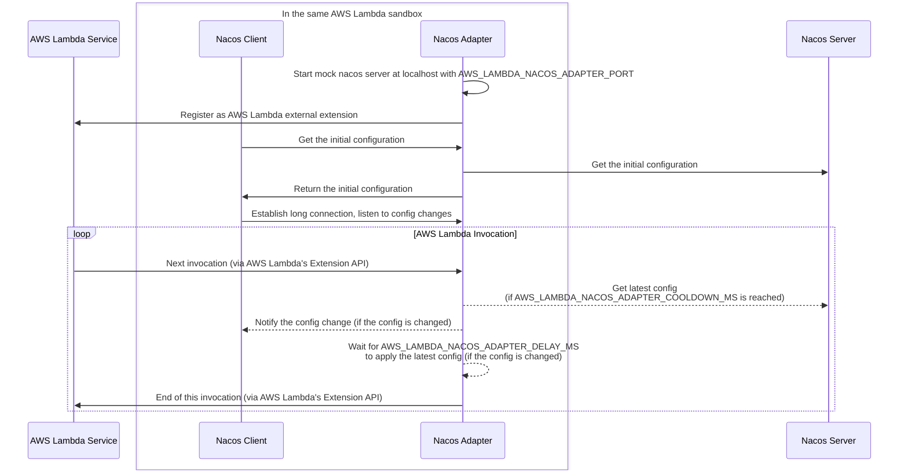

# AWS Lambda Nacos Adapter

Let your AWS Lambda functions listen to your configuration changes on Nacos.

## Usage

### Passthrough Mode

TODO

### FS Mode

TODO

## Environment Variables

### Mode Selection

- `AWS_LAMBDA_NACOS_ADAPTER_ORIGIN_ADDRESS`
  - The address of the origin Nacos server.
  - Set this to enable the adapter to run in [passthrough mode](#passthrough-mode).
- `AWS_LAMBDA_NACOS_ADAPTER_CONFIG_PATH`
  - The path to your configuration file.
  - Set this to enable the adapter to run in [fs mode](#fs-mode).
  - Default: `/mnt/efs/nacos/`

### Optional

- `AWS_LAMBDA_NACOS_ADAPTER_PORT`
  - The port number that the adapter listens on.
  - Default: `8848`
- `AWS_LAMBDA_NACOS_ADAPTER_CACHE_SIZE`
  - The maximum number of entries that the cache can hold.
  - Default: `64`
- `AWS_LAMBDA_NACOS_ADAPTER_DELAY_MS`
  - The delay in milliseconds after the configuration refresh, before the adapter mark this invocation as done.
  - This is useful to make sure the configuration is applied to your handler function before the next invocation. If this is too small and your handler function returns too quickly, your handler function may not get the updated configuration.
  - This won't affect your function's response time, but if the config is changed, it may increase your function's duration.
  - Default: `100`
- `AWS_LAMBDA_NACOS_ADAPTER_COOLDOWN_MS`
  - The cooldown in milliseconds before the adapter refresh the configuration again.
  - If you want your configuration to be applied as soon as possible, reduce this value. If you want to reduce the number of requests to the origin server, increase this value.
  - Default: `0`

## How It Works

## Limits

- The updated config might be applied from the second invocation after the refresh if your function returns very fast, instead of the next invocation.

## Credits

This project references many code snippets from [nacos-group/r-nacos](https://github.com/nacos-group/r-nacos/).
