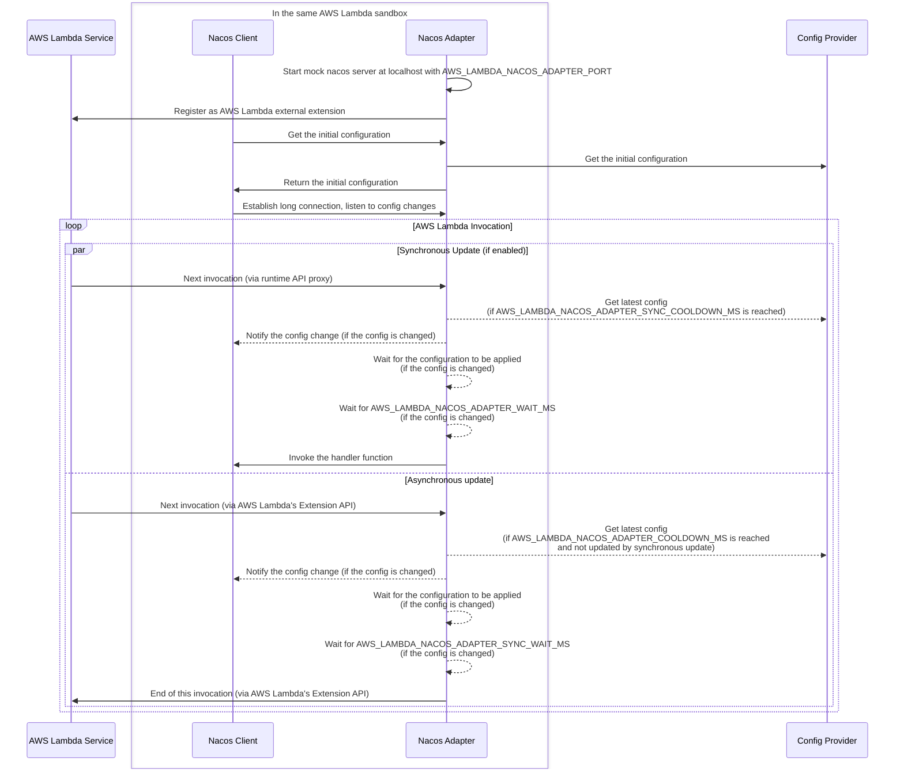
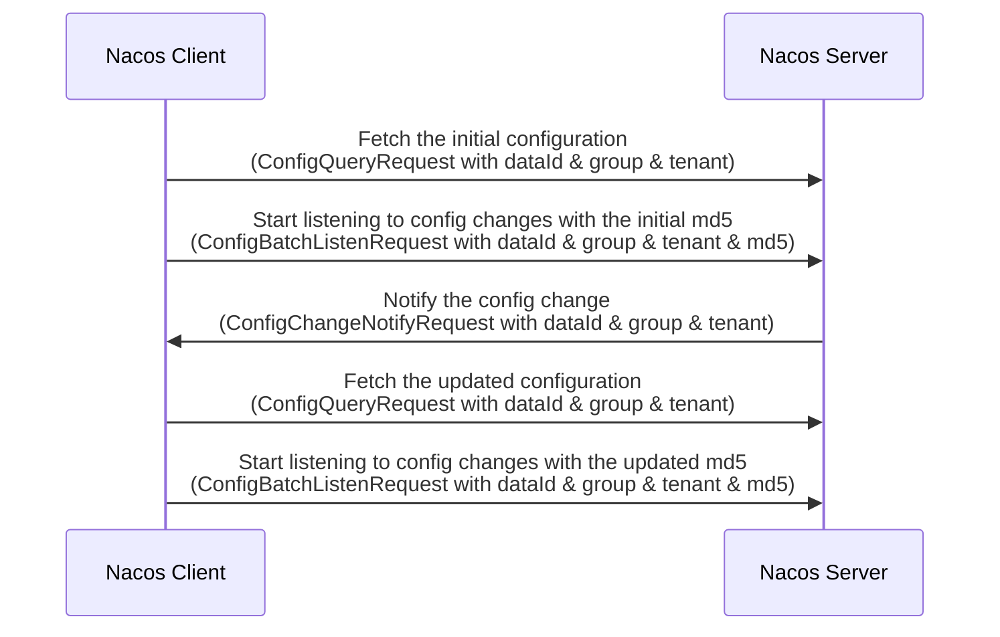

# Nacos Adapter Demo on AWS Lambda

Let your AWS Lambda functions listen to your configuration changes on Nacos. Supports both Nacos v1 (HTTP) and Nacos v2 (gRPC).

## Usage

This can be used as an AWS Lambda Layer.

1. Run `sam build` to build the layer, then run `sam deploy -g` to deploy the layer.
2. Add the layer to your lambda function.
3. Set your function's [environment variables](#environment-variables) (see below) to configure the adapter.
4. Specify the Nacos server to `127.0.0.1:8848` (or the port you set) for your app.

## Getting Started

### Choose a Config Provider

#### Passthrough Mode

In this mode, you must provide a valid Nacos server address via the `AWS_LAMBDA_NACOS_ADAPTER_ORIGIN_ADDRESS` environment variable. If your Nacos server can only be accessed via an AWS VPC using a private IP address, you have to [connect your AWS Lambda functions to the VPC](https://docs.aws.amazon.com/lambda/latest/dg/configuration-vpc.html) too.

When your AWS Lambda functions are invoked, the adapter will fetch the latest configuration from the Nacos server and notify your functions if the config changes.

#### FS Mode

In this mode, you can provide a path as the configuration source via the `AWS_LAMBDA_NACOS_ADAPTER_CONFIG_PATH` environment variable. The adapter will try to read `{AWS_LAMBDA_NACOS_ADAPTER_CONFIG_PATH}{tenant}/{group}/{dataId}` as the configuration.

If your configuration won't change, you can provide a static configuration file to the adapter. If your configuration will change, you can use a shared file system like Amazon EFS to share the configuration between your functions.

When your AWS Lambda functions are invoked, the adapter will read the latest configuration from the file system and notify your functions if the config changes.

This mode is useful if you don't want your AWS Lambda functions to access your Nacos server too frequently in passthrough mode.

### Enable Synchronous Update

By default, the adapter will update the configuration asynchronously, no matter the mode is passthrough or fs. The good thing about asynchronous update is that it won't introduce additional latency to your function's invocation. The downside is that the configuration update might be applied in the next invocation instead of the current one.

This should be fine if your function is invoked frequently. But if your function is invoked infrequently, you may want to update the configuration synchronously if the last update is too long ago, which means the configuration is updated first, then your handler function is invoked.

This might introduce additional latency to your function's invocation, you can control the cooldown time via the `AWS_LAMBDA_NACOS_ADAPTER_SYNC_COOLDOWN_MS` environment variables to prevent synchronous update from happening too frequently.

This feature requires runtime api proxy to realize, so you have to modify your handler function's environment variable `AWS_LAMBDA_RUNTIME_API` to override the default value. This environment variable is preserved by AWS Lambda, so you have to use [wrapper scripts](https://docs.aws.amazon.com/lambda/latest/dg/runtimes-modify.html) to override it. You can checkout the [`scripts/`](./scripts/) folder for the basic wrapper scripts.

## Environment Variables

### Config Provider

- `AWS_LAMBDA_NACOS_ADAPTER_ORIGIN_ADDRESS`
  - The address of the origin Nacos server.
  - Set this to enable the adapter to run in [passthrough mode](#passthrough-mode).
  - Example: `172.31.0.123:8848`.
- `AWS_LAMBDA_NACOS_ADAPTER_CONFIG_PATH`
  - The path to your configuration files.
  - Set this to enable the adapter to run in [fs mode](#fs-mode).
  - If you already set `AWS_LAMBDA_NACOS_ADAPTER_ORIGIN_ADDRESS`, this will be ignored.
  - Default: `/mnt/efs/nacos/`

### Asynchronous Update

- `AWS_LAMBDA_NACOS_ADAPTER_COOLDOWN_MS`
  - The cooldown in milliseconds before the adapter refresh the configuration again.
  - If you want your configuration to be applied as soon as possible, reduce this value. If you want to reduce the number of requests to the origin server, increase this value.
  - Default: `0`.
- `AWS_LAMBDA_NACOS_ADAPTER_WAIT_MS`
  - The time in milliseconds that the adapter waits for the handler function to apply the updated configuration, before finishing the invocation.
  - Default: `0`.

### Synchronous Update

- `AWS_LAMBDA_EXEC_WRAPPER`
  - See the [AWS official documentation](https://docs.aws.amazon.com/lambda/latest/dg/runtimes-modify.html) about this environment variable.
  - See the [examples](./examples/) for how to use this environment variable.
  - This must be set to enable synchronous update.
- `AWS_LAMBDA_NACOS_ADAPTER_SYNC_PORT`
  - The port number that the runtime API proxy listens on for synchronous update.
  - You can set this to any port number that is not used by other processes.
  - This must be set to enable synchronous update.
- `AWS_LAMBDA_NACOS_ADAPTER_SYNC_COOLDOWN_MS`
  - The cooldown in milliseconds before the adapter refresh the configuration again for synchronous update.
  - This should be no less than `AWS_LAMBDA_NACOS_ADAPTER_COOLDOWN_MS` (the asynchronous cooldown).
  - Default: `0`.
- `AWS_LAMBDA_NACOS_ADAPTER_SYNC_WAIT_MS`
  - The time in milliseconds that the adapter waits for the handler function to apply the updated configuration, before invoking the handler function.
  - Default: `0`.

### Misc

- `AWS_LAMBDA_NACOS_ADAPTER_PORT`
  - The port number that the mock Nacos listens on.
  - Default: `8848`.
- `AWS_LAMBDA_NACOS_ADAPTER_CACHE_SIZE`
  - The maximum number of entries that the cache can hold.
  - Default: `64`.

## [Examples](./examples/)

## Performance vs Timeliness

Here are examples of environment variable settings for different scenarios:

### Most Timely

By enabling synchronous update and set the cooldown to 0ms, the adapter will always update the configuration first, then invoke your handler function. This will make sure your handler function always gets the latest configuration.

```yaml
AWS_LAMBDA_NACOS_ADAPTER_SYNC_COOLDOWN_MS: 0
AWS_LAMBDA_NACOS_ADAPTER_SYNC_WAIT_MS: 10 # adjust this value according to your application
```

Performance: if the config is not changed, the adapter will introduce an additional delay to your function's **_each_** invocation when fetching the latest config; if the config is changed, besides the delay caused by fetching the config, the adapter will introduce an additional delay to wait for your configuration to be applied.

### Balanced

It's recommended to enable synchronous update, and set the cooldown to a reasonable value for both synchronous and asynchronous update.

```yaml
# all these values are adjustable
AWS_LAMBDA_NACOS_ADAPTER_COOLDOWN_MS: 5000 # 5 seconds
AWS_LAMBDA_NACOS_ADAPTER_WAIT_MS: 10
AWS_LAMBDA_NACOS_ADAPTER_SYNC_COOLDOWN_MS: 60000 # 1 minute
AWS_LAMBDA_NACOS_ADAPTER_SYNC_WAIT_MS: 10
```

In the examples above, since the cooldown for synchronous update is much longer than the cooldown for asynchronous update, the adapter will update the configuration asynchronously for most invocations (if the function is frequently invoked), and update the configuration synchronously if the last update is too long ago.

## How It Works

### Sequence Diagram



### How Does This Know the Configuration is Applied in the Handler Function?

The following sequence diagram shows how the Nacos client fetches the initial configuration, listens to the config changes, and fetches the updated configuration.



No matter in synchronous or asynchronous update, after the adapter notified the handler function with the updated configuration, the adapter will wait until a subsequent `ConfigBatchListenRequest` is sent from the handler function with the updated md5.

This mechanism ensures that the handler function has applied the updated configuration. However, if you are using some framework like Spring Boot, your application may not reload the configuration immediately after the configuration file is updated. In this case you should configure `AWS_LAMBDA_NACOS_ADAPTER_WAIT_MS` and/or `AWS_LAMBDA_NACOS_ADAPTER_SYNC_WAIT_MS` to wait for the application to reload the configuration.

Besides, since we can't distinguish the sender of the `ConfigBatchListenRequest`, you can only have one Nacos client in your handler function, otherwise this checking mechanism won't work.

## Credits

This project references many code snippets from [nacos-group/r-nacos](https://github.com/nacos-group/r-nacos/).

## [CHANGELOG](./CHANGELOG.md)

## Security

See [CONTRIBUTING](CONTRIBUTING.md#security-issue-notifications) for more information.

## License

This library is licensed under the MIT-0 License. See the LICENSE file.
